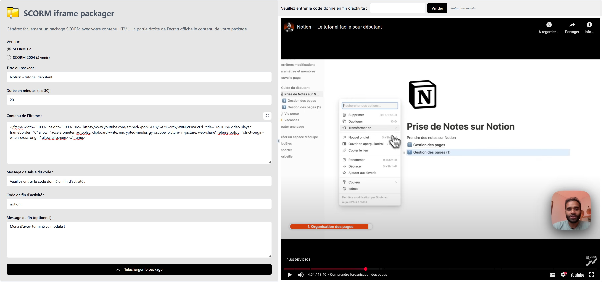

# SCORM iframe packager

## Générez facilement un package SCORM avec votre contenu web

Cette app JavaScript permet de réaliser et de télécharger un package SCORM contenant une iframe avec un contenu provenant d'une url ou d'un lien de partage web. L'apprenant doit rentrer un code pour passer le module à complété.

## ▶ [Lien vers l'outil](https://realjck.github.io/scorm-iframe-packager/)

_Note : La génération de package SCORM 2004 n'est pas complet pour l'instant mais seulement l'implémentation en SCORM 1.2._